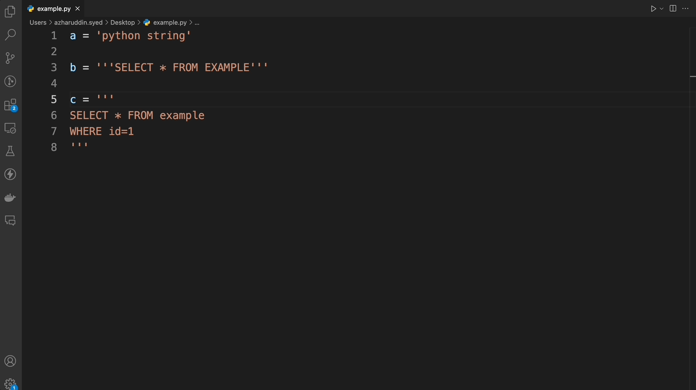
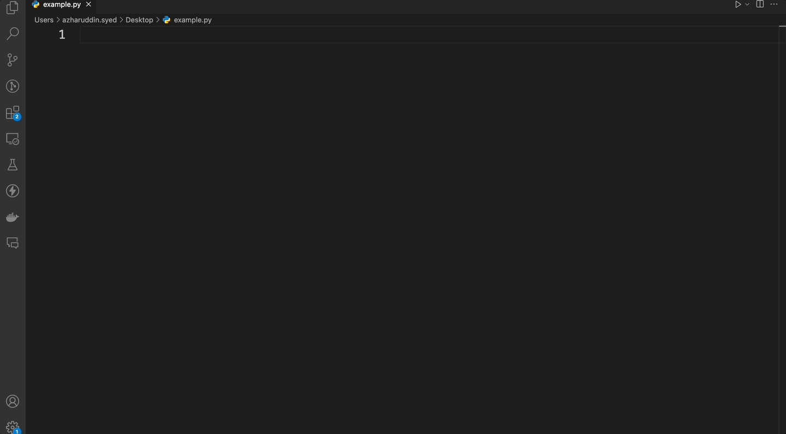
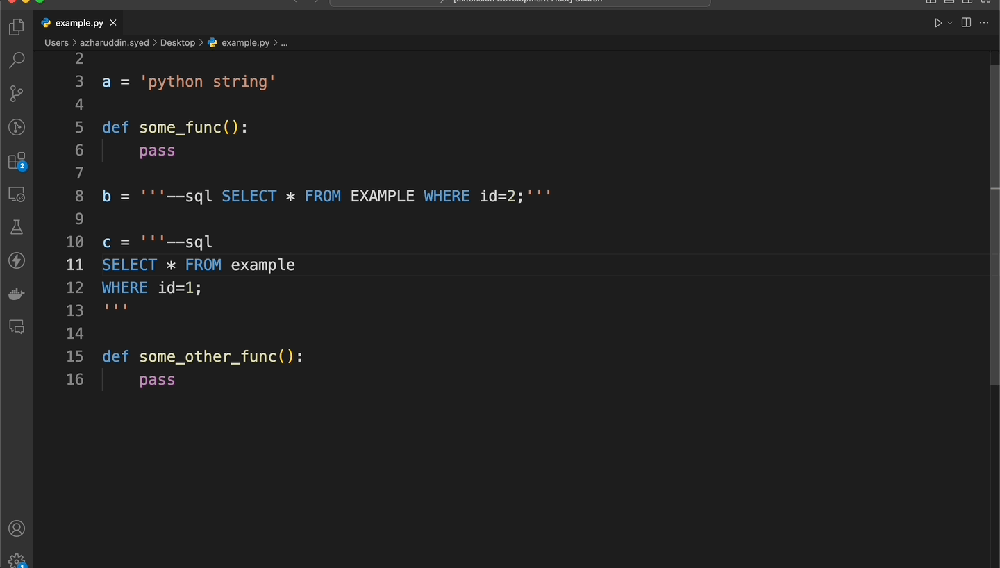

# python-sql README

## Description

**python-sql** is a Visual Studio Code extension designed to enhance the developer experience when working with SQL embedded in Python strings. This extension provides syntax highlighting and quick suggestions, making it easier to write, read, and maintain SQL code within Python scripts.

## Features

- **Syntax Highlighting**: Highlights SQL syntax within Python strings when they contain the '--sql' token.
  

  
- **Quick Suggestions**: Offers real-time SQL code suggestions to speed up development.
  

  
- **Remove SQL Embeddings**: Provides a command to remove all '--sql' tokens from the code. 
Usage: Option/Alt + Shift + R
  

  

## Requirements

- Visual Studio Code version 1.50.0 or higher.
- Python extension for VS Code (optional, but recommended for a better Python development experience).

## Installation

1. Open VS Code.
2. Go to the Extensions view by clicking on the Extensions icon in the Activity Bar on the side of the window or pressing `Ctrl+Shift+X`.
3. Search for "python-sql".
4. Click "Install" to install the extension.
5. Reload VS Code to activate the extension.

## Release Notes

### 1.0.0

- Initial release of python-sql.

### 1.1.0

- Handle f string variable substitution causing Quick Suggestions failure.
- Enhance TextMate grammar to make closing token redundant.

---

## Contributing

If you encounter any issues or would like to contribute to this extension, please create a issue or raise a PR by visiting the [Github repo](https://github.com/azhar316/python-sql).

**Enjoy your enhanced Python-SQL coding experience!**